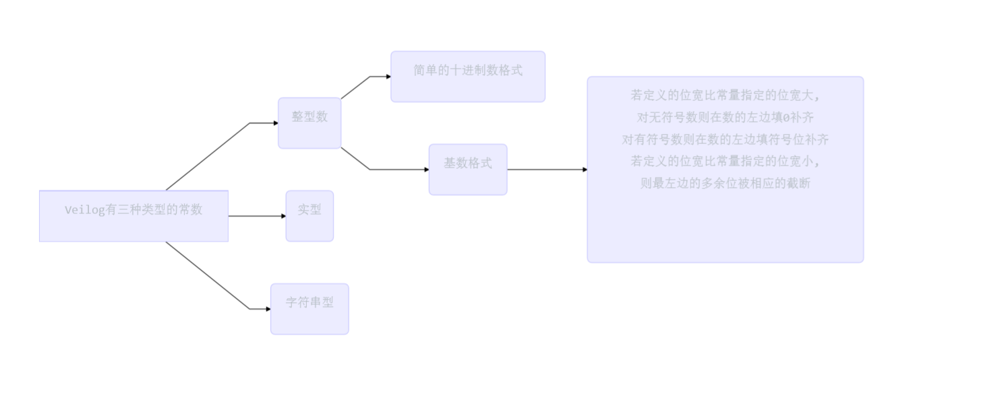

## # 第三章 Verilog语言要素

## 3.6 值集合

​	Verilog有以下四种基本值：

   1. 0	逻辑0或“假”

   2. 1    逻辑1或“真”

   3. x    未知

   4. z     高阻

      >  x、z不区分大小写，0x1z和0X1Z是等价的。

	> 下划线符号_可以自由地在整数或实数中使用，增加易读性。

## 3.7数据类型

* 线网数据类型：表示Verilog结构化元件的物理连线。线网的值由驱动元件的值决定，例如连续赋值或门的输出。**如果没有驱动元件连接到线网，线网的缺省值为z**
* 变量类型：表示一个**抽象**的数据存储单元，**它只能在always语句中和initial语句中被赋值**，变量的值被从一条赋值语句保存到下一条赋值语句，**变量类型的缺省值为x**。

### 3.7.1 线网类型

| wire | trior  | trireg | tri  | wand    | tri1 |
| ---- | ------ | ------ | ---- | ------- | ---- |
| wor  | triand | tri0   | wlr  | supply1 |      |

#### 1. wire

​	wire 类型是用于连接电路元件最常见的线网类型。

其余略

### 3.7.2 未声明的线网

​	在verilog HDL中，对某个信号的线网类型不予声明也是可以的。在这种情况下，**线网类型被缺省地设置为1位的wire型线网**。这一隐含的线网声明可以使用`default_nettype编译器指令加以改善。

### 3.7.3 向量线网和标量线网

​	在定义向量线网时可选用关键词**scalared**或**vectored**，若使用关键词**vectored**定义线网，则不允许选择该向量的某位和选择该向量的部分位。换言之，必须对线网整体赋值。

​	**若没有指定这样的关键词，缺省设置为scalared（标量）。**

### 3.7.4 变量类型

| reg     | real |
| ------- | ---- |
| integer | time |

#### 1. reg 变量类型

​	*注：用变量声明赋值语句可以把变量初始化位常数	例：reg  intf_reg = 2；*

​	reg \[signed][[msb:lsb]] reg1,reg2,...regN;		范围定义是可选的，若没有定义范围，则缺省设置为1位的reg变量。

#### 2. 存储器（memories）

​	reg[[msb:lsb]] memory1，memory2,...,memoryN；

	> 例 reg[3:0] mem [63:0]
	>
	> ​	表示64个4位reg变量组成的数组

​	存储器术语变量数据类型，2维数以上的数组和线网类型的数组都是允许的。

​	**在赋值语句中注意如下区别：存储器赋值不能在一条赋值语句中完成，但reg变量却可以。**

### 3.7.5 数组

​	线网和变量的多维数组可以用一条数组语句予以声明，数组的元素可以是标量值或者向量值。

​	**不能用一条辅助语句就把某个数组的值赋给另一个数组，只能对数组的一个元素进行赋值操作。**

### 3.7.6 **reg与wire的不同点**

	* reg变量只能在always和initial语句中赋值，未初始化的值为x。
	* wire线网只能用连续赋值语句赋值，或者通过模块实例的输出（和输入/输出）端口赋值，未初始化的值为z。

## 3.8 参数

​	Q：parameter(参数)和`define(宏定义)究竟有什么不同呢？

​	A：**参数是局部的，只在其定义的模块内部起作用，而宏定义对同时编译的多个文件起作用。**即使在某一个模块内部指定的宏定义，在编译过程中仍旧对多个文件起作用，知道遇到重新定义为止。因此为了保险起见，读者应该将`define严格地用于全局变量和全局文本地替换，而将参数用于某个模块内部所需要的常数。

#### 局部参数

​	局部参数是模块内部的参数。在实例引用该模块时不能 通过参数传递或者重新定义参数defparam语句对局部参数进行修改。除了所用的关键词为**localparam**，不同于**parameter**外，从句法的角度看，局部参数的声明与普通参数的声明语句完全一致。