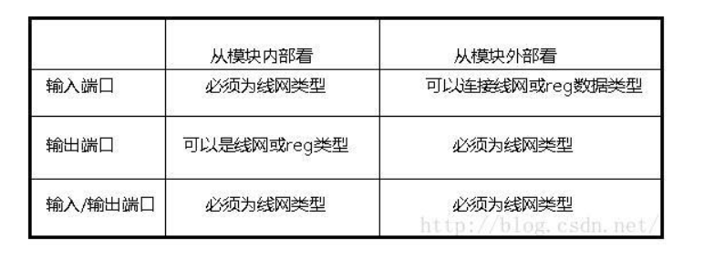

# 第七章 数据流建模

​		**连续赋值语句常用来建立数据流行为模型，用于组合逻辑电路；而过程性赋值语句常用来为时序电路建立行为模型。**

## 7.1 连续赋值语句

​		连续赋值语句可用来为线网进行赋值（**不能用来对寄存器进行赋值**），他的格式如下：

​		*assign  LHS_target  =  RHS_expression；*

​		需要特别指出的是，**在连续赋值语句中一定有关键词assign出现**。连续赋值语句什么时候执行呢?只要右侧表达式中有事件发生（即操作数值改变）时，就会计算右侧表达式；若新的结果值与原来的值不同，则把新的结果值赋给左侧的被赋值目标。

## 7.3 线网声明赋值

​		连续赋值可以作为线网声明的一部分，这样的赋值成为**线网声明赋值**。

​		**不允许对一个线网进行多个线网声明赋值。若必须进行多个赋值，则必须是用连续赋值语句。**（Q：对一个线网进行多个连续赋值，线网的值到底是哪个？）

## 7.4 赋值延迟

​		*例：	assign #6 dbg_data  =  int_data  ||  peg_cstxt;*

​		上述赋值语句中指定的延迟，是指从右侧表达式中任一操作数的变化，到右侧表达式的重新计算，再把计算结果付给左侧的复制目标总共需要6个时间单位的延迟。

​		**若在把右侧的值传给左侧之前，右侧的值发生了变化，会怎么样呢？在这种情况下，最后一次的值的变化将起决定作用。**详情见p93。

​		在每个延迟的生命中，总共有三个延迟值可以被指定：

   * 上升延迟值

   * 下降延迟值

   * 截止延迟值

     ​	若被赋值的目标是向量线网，那么上升延迟意味着什么呢？若右侧表达式的值从非0向量变化到0向量，则使用下降延迟；若右侧表达式的值变化到z，则使用截至延迟，其余的情况都使用上升延迟。

## 7.5 线网延迟

​		延迟也可以在线网声明中定义，如下面的赋值语句。

​		*例：	wire #5	mem_write;*

​		该延迟指的是mem_write驱动源的值发生改变到线网mem_write本身的值发生改变的延迟。

​		**首先赋值延迟起作用，然后加上线网延迟产生的作用。**


# 第八章行为级建模

## 8.1 过程性结构

​		下面两种语句是对设计进行行为级建模的主要结构：

  1. initial 语句

  2. always 语句

       一个模块中可以包含任意多条的initial语句或always语句，这些语句相互之间是并行执行的，换言之，这些语句在模块中的顺序并不重要。一条initial语句或always语句的执行会产生一个单独的控制流，所有的initial语句和always语句都是在0时刻开始并行执行的。     

### 		8.1.1 initial语句

​			一条initial语句只执行一次。

 ### 		8.1.2 always语句

 			always语句反复执行。	

## 8.2 时序控制

###  		8.2.1 延迟控制

​		延迟控制指定了从到达该语句到执行该语句的时间间隔。若延迟表达式的值为0，则称为**显式零延迟**。显式零延迟触发一个等待，**直到所有其他的在当前仿真时刻要被执行的时间执行完毕后，才将其恢复；仿真时间不会前进。**若延迟表达式为x或z，则它等效于零延迟。若延迟表达式计算结果为负值，则将其二进制补码值作为延迟。若延迟值包含了空格字符或是表达式，则要用圆括号把延迟值括起来。

### 		8.2.2 事件控制

   1. 跳变沿敏感事件控制

   2. 电平敏感事件控制

      wait(condition)

      ​		procedural_statement

      只有当过程性语句为真时才执行。

## 8.3 语句块

​		**语句块提供了一种机制，可以将两条或更多语句并置成一种相当于一条语句的语法结构。**

​		在Verilog中有两种语句块：

   * 顺序语句块(begin...end)：语句块中的语句按给定次序顺序执行。

   *  并行语句块(fork...join)：语句块中的语句并行执行。

     语句块的标识符是可选的。若有标识符，则可以在语句块内部声明局部变量。**带标识符的语句块还可以被引用，例如使用disable来禁止某个标识语句块的执行。**此外，语句块标识符提供了一种可对变量作唯一标识的途径。但是要注意所有的局部变量均是静态的，**即他们的值在整个仿真运行期间保持不变**

     ### 8.3.1 顺序语句块

     ​		顺序语句块中的语句是按顺序执行的。每条语句的延迟值与其前一条语句执行的仿真时间是相关的。一旦顺序语句块执行完毕后，紧随该顺序语句块内的下一条语句将继续执行。

     ### 8.3.2 并行语句块

     ​		并行语句块内的每一条语句是并行执行的，在并行语句块内的每条语句指定的延迟值都是相对于语句块开始执行的时刻的，当并行语句块中的最后一个行为（并不一定是最后一条语句）执行完成时，再继续执行这个并行块后面的其他语句。换言之，在执行跳出语句块前必须执行完并行语句块内的所有语句。

## 8.4 过程性赋值

​		**过程性赋值是在initial语句或always语句内进行的赋值，它只能用来对变量数据类型赋值。**

### 			8.4.1 语句内部延迟

### 			8.4.2 阻塞性过程赋值 						=	

​			阻塞性过程赋值语句是在其后所有的语句执行前执行的，即在下一条语句执行前，该赋值语句必须已全部执行完	毕。

### 			8.4.3 非阻塞性过程赋值						<=

​			当非阻塞性过程赋值语句执行时，计算右侧的表达式，然后在预定时刻将右侧的值赋给左式的目标，并继续执行下一条语句。最快的输出也要在**当前时刻结束前的最后一刻，可以确保读操作发生在写操作之前。**同时Verilog HDL规定，**对同一个变量的非阻塞型复制应该按照赋值语句执行的顺序来执行。（ps:不过不要在不同的语句块中对同一变量进行非阻塞性赋值）**		

### 		8.4.4 连续赋值和过程赋值的比较

​			见P120。

## 8.5 条件语句

```verilog
	if(condition1)

		procedural_statement1

	else if(condition2)

		procedural_statement2

	else

		procedural_statement3
```

​		若对condition_1求值的结果为一个非零值，则执行procedural_statement1。若对condition_1求职的结果为0、x或z，则不执行procedural_statement1，若存在一个else分支，则执行这个分支。

## 8.6 case语句

​		条件表达式和各分支项表达式都不必是常量表达式。**在case语句中，x和z作为字符串比较。**

```verilog
		case(...)

			xxx:

			xxx:

			default:

		endcase
```

​		这里有case语句的两种其他形式：casex和casez，这些形式对x和z值使用了不同解释。

## 8.7 循环语句

​		Verilog HDL有4类循环语句

* forever
* repeat
* while
* for

## 8.8 过程性连续赋值

​		过程性连续赋值是一种**过程性赋值，**换言之，过程性连续赋值是一种能够在initial和always语句块中出现的语句。这种赋值方式可以**改写(Override)所有其他语句对线网或者变量的赋值。它允许赋值语句中的表达式被连续的驱动进入到变量或线网当中去。**

​		过程性赋值语句有两种类型：

* assign和deassign过程性语句，对变量进行赋值。

* force和release过程性语句，虽然也可以用于对变量赋值，但主要用于对线网赋值。

  

​	   assign和force语句在某种意义上是**“连续性”**的，换言之，当assign语句和force语句生效时，右式中操作数的任何变化都会引起赋值语句的重新执行。

# 第九章 结构建模



